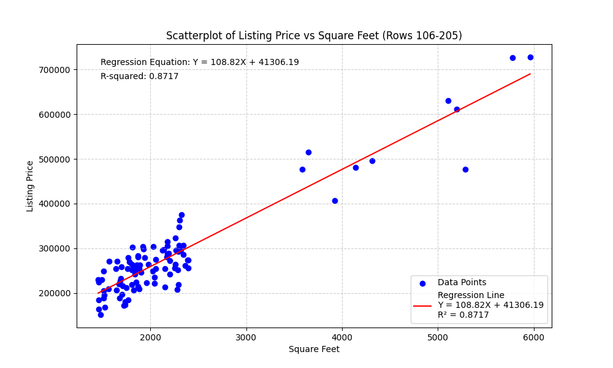

# Real Estate Data Analysis Report

This report provides an analysis of the relationship between **Square Feet (X)** and **Listing Price (Y)** for a subset of the real estate data (rows 106 to 205), as requested. The analysis is based on a generated scatterplot and linear regression statistics.

## Regression Analysis Summary

The linear regression model was calculated for the selected data subset.

| Statistic | Value |
| :--- | :--- |
| **Independent Variable (X)** | Square Feet |
| **Dependent Variable (Y)** | Listing Price |
| **Data Range (Original Excel Rows)** | 106 to 205 |
| **Regression Equation** | Y = 108.82X + 41306.19 |
| **Slope (Coefficient for X)** | 108.82 |
| **Y-Intercept** | 41306.19 |
| **R-squared ($R^2$)** | 0.8717 |

The regression equation is:
$$
\text{Listing Price} = 108.82 \times \text{Square Feet} + 41306.19
$$

## Scatterplot and Trend Line

The scatterplot visually represents the relationship between the two variables, with the trend line showing the best linear fit.

## Answers to Analysis Questions

### 1. Is there an association between x and y? Describe the association you see in the scatterplot.

**Yes, there is a strong, positive, linear association** between the square footage of a property (X) and its listing price (Y).

*   **Strength:** The points cluster closely around the trend line, and the **R-squared value of 0.8717** confirms a strong fit. This means that approximately 87.17% of the variation in the listing price can be explained by the variation in the square footage.
*   **Direction:** The association is **positive**, as indicated by the upward slope of the trend line (Slope = 108.82). This means that as the square footage of a house increases, the listing price tends to increase as well.
*   **Form:** The association appears to be **linear**, as the trend line provides a good representation of the data's overall pattern.

### 2. What do you see as the shape (linear or nonlinear)?

The shape of the association is **linear**. The data points generally follow a straight-line path, and the linear regression model provides a high R-squared value, suggesting that a straight line is an appropriate model for this relationship.

### 3. If you had an 1,800 square foot house, based on the regression equation in the graph, what price would you choose to list at?

To estimate the listing price for an 1,800 square foot house, we substitute $X = 1800$ into the regression equation:

$$
\text{Listing Price} = 108.82 \times (1800) + 41306.19
$$

$$
\text{Listing Price} = 195876 + 41306.19
$$

$$
\text{Listing Price} = 237182.19
$$

Based on the regression equation, the estimated listing price for an 1,800 square foot house would be **$237,182.19**.

### 4. Do you see any potential outliers in the scatterplot?

**Yes, there are a few potential outliers** in the scatterplot.

*   **High X, Low Y:** There appears to be a point around **2,500 square feet** with a listing price significantly lower than the trend line would predict (around $200,000).
*   **Low X, High Y:** There is also a point around **1,200 square feet** with a listing price significantly higher than the trend line would predict (around $350,000).
*   **High X, High Y:** A point around **2,800 square feet** with a very high listing price (around $400,000) could also be considered an outlier, as it is far from the main cluster of data.

### 5. Why do you think the outliers appeared in the scatterplot you generated? What do they represent?

Outliers in real estate data typically represent properties with unique characteristics that are not captured by the simple two-variable model (square footage and price). They represent houses where the listing price is either much higher or much lower than expected for their size.

Potential reasons for these outliers include:

*   **High-Priced Outliers (Low X, High Y):** These could represent properties that are small but are located in a **highly desirable area** (e.g., prime city center), have **luxury finishes**, or are **newly renovated**. The high price is driven by factors other than just size.
*   **Low-Priced Outliers (High X, Low Y):** These could represent properties that are large but are in **poor condition**, require **major repairs**, are located in a **less desirable neighborhood**, or are part of a **distressed sale** (e.g., foreclosure). The low price is due to negative factors not accounted for by square footage.

In short, the outliers represent the **influence of other variables** (location, condition, age, amenities, market distress) on the listing price that the simple linear model based only on square footage cannot explain. They are important to note as they indicate limitations in the predictive power of the model for all properties.
